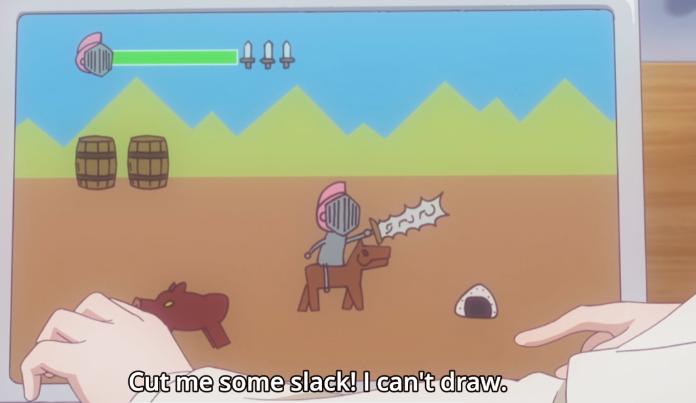
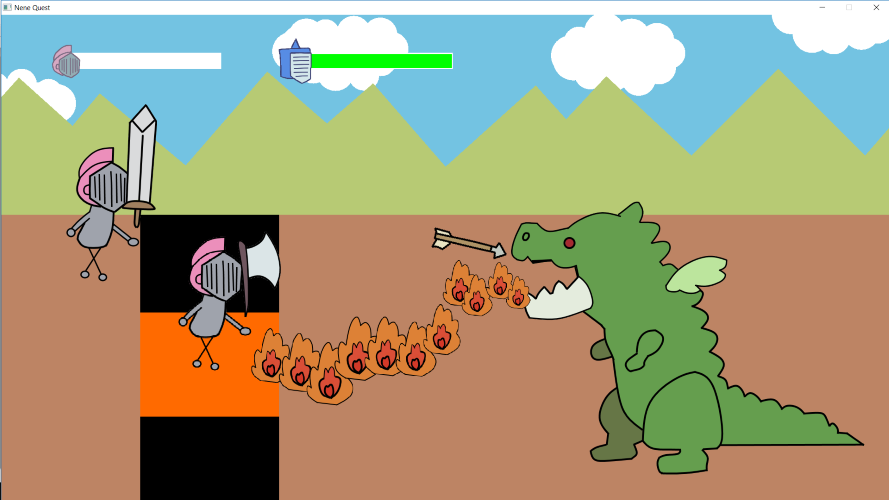

Reproduction of Nene Sakura's game "Nene Quest" from "New Game!!" (2nd season, episode 3) written in C++ with the SFML library.

# Preview

## Original

## nene-quest

# Compilation & Execution

We currently don't have any release yet so you have to compile the project by yourself.

* Download SFML 2.4.2 : https://www.sfml-dev.org/download/sfml/2.4.2/

* Link SFML to your IDE :
  + Windows
    - Visual Studio : https://www.sfml-dev.org/tutorials/2.4/start-vc.php
    - Code Blocks : https://www.sfml-dev.org/tutorials/2.4/start-cb.php
  + Linux : https://www.sfml-dev.org/tutorials/2.4/start-linux.php
  + MacOS (Xcode) : https://www.sfml-dev.org/tutorials/2.4/start-osx.php
  + Compilation with CMake : https://www.sfml-dev.org/tutorials/2.4/compile-with-cmake.php
  
* Don't forget to put the .dll files in the right folder. These files are located in `<SFML path>/bin`

* In Visual Studio
  + Make a new project/solution
  + Clone the git repository inside the project with `git clone https://github.com/engboris/nene-quest.git`
  + Include the `nenequest/headers` folder in your IDE's "Additional Include Directories" (in Visual Studio : `Project > [project name] properties... > C/C++ > General`)
  + Left-click on the "Show all files" button on the "Solution Explorer" on the right corner
  + Right-click on the `src` and `headers` folders then select "Include in the project"
  + You can navigate in the files with the "Solutions and folders" button in the right corner
  + Now, you should be able to compile the project
